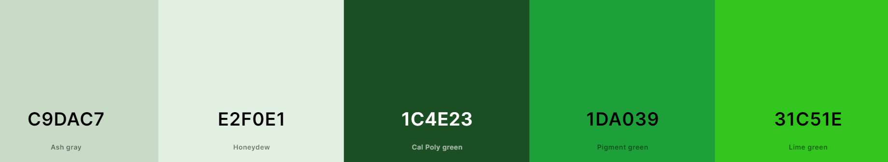

# Meal Share React Front-End

This is my Front-End for my PP5, Meal Share. 

Visit the live deployed site here: [Meal Share](https://meal-share-b5f074a2fcfd.herokuapp.com/).

Link to the Back-End Readme is here [Back-End Readme](https://github.com/reltoom/df-api-project5/blob/main/README.md)

## CONTENTS

* [User Experience](#user-experience-ux)
  * [Site Goals](#site-goals)
  * [Planning Process](#planning-process)
  * [User Stories](#user-stories)
* [Design](#design)
  * [Colour Scheme](#colour-scheme)
  * [Future Implementations](#future-implementations)
* [Features](#features)
* [Technologies](#technologies)
  * [React & Components](#react-and-reusable-components)
  * [Libraries](#front-end-libraries-used)
  * [Languages](#languages)
  * [Websites & Programs](#websites-programs)
* [Deployment](#deployment)
* [Testing](#testing)
   * [Manual Testing](#manual-testing)
   * [Validator Test](#validator-test)
* [Credits](#credits)
  * [Code Used](#code-used)
  * [Acknowledgments](#acknowledgments)

## User Experience
### Site Goals
Meal Share is to be a site for all types of food lovers to come and share their favorite recipes and recipe books. Here user can interact with others: comment, like and follow each other and posts. If you are stuck on what to cook for dinner again... go to the Surprise me page and it will choose a random Post/Recipe for you. 

### Planning Process
Meal Share follows the Moments walkthrough structure, but is customized to be something different. Baslamiq was used to create original wireframes.

I wanted a more complex form for Post creation. Originally I had planned to do a nested serializer and spent several days trying to get it to work, but as I was told by a tutor eventually that nested serilizers were not supported by DRF, atleast how I was trying. Custom code would have been only workaround. So I had to start over and add on simple. After that I added on the Book page for recommend recipe books as that is another way to help people discover cooking ideas.

Using GitHub to keep track of Agile workmethodology.
* Once the user stories were completed, I would move several of them into the 'Todo' column from 'no status'.
* Each sprint consisted of an epic or part of an epic. Once work start on this. I moved User Stories from the 'Todo' to 'In Progress'.
* When a User Story was completed, it was moved to the 'Done' column.
* If not all User Stories were completed in that sprint, I would reorganize and add them to the next sprint(if they were prioritized).

### User Stories

<b>Users Stories with Project goals<b>

## Project Goals

The primary goals of this project are to:
1. Enable users to create and manage content.
2. Enhance user engagement through interactions like following, liking, and commenting.
3. Provide a personalized user experience.
4. Ensure a smooth and intuitive user interface.

# User Stories

## Content Management
1. Create a Post

As a user I can create a post so that I can share my meal ideas with others.

***Acceptance Criteria

* User must be logged in to create a Post
* Post should include: recipe name, description, ingredients, directions, meal type and image.
* The post is saved to the database and appears on the user's profile and in the main feed upon successful creation.

2. Edit a Post

As a user I can edit my post so that I can correct or update its content.

***Acceptance Criteria

* Users must be logged in and must be the author of the post to edit it.
* Users can modify the contents of the Post.
* Changes are saved to the database and updated the posts view.
* Can be cancelled

3. Delete a Post

As a user I can delete my post so that I can remove content I no longer want to share

***Acceptance Criteria

* Users must be logged in and be the owner of the post to delete it.
* Users are prompted to confirm the deletion.
* The post is removed from the database and no longer appears on the views.

4. View a List of Posts

As a user I can view a list of posts so that I can see updates from other users

***Acceptance Criteria

* Users can see a list of posts with newest first
* Each post in list shows: user who created, date, Recipe name and description, image
* Users can click on a post's recipe name or image to view full post

5. View a Single Post

As a user I can view a single post so that I can read the full content and see any associated comments

***Acceptance Criteria

* Users can view the full title and context of a post
* Comments related to the post are displayed below the post content.

## User Engagement

6. Like/Unlike a Post

As a user I can like or unlike a post so that I can show my appreciation or change my feedback

***Acceptance Criteria

* User must be logged in to like or unlike, and cannot like their own posts
* Like count is updated and displayed in real-time
* Users can only like a post once.

7. Comment on a Post

As a user I can comment on a post so that I can engage with the author and other users

***Acceptance Criteria

* Users must be logged in to leave a comment on a post
* Users can submit a comment containing text.
* Comment is saved to the database and appears under the post after being saved.

8. View Comments

As a user I can view comments on a post so that I can see what others have said about it.

***Acceptance Criteria

* Comments are displayed with newest first.
* Each comment shows the author and time of creation.
* Number of comments is counted underneath the post.

9. Edit My Comment

As a user I can edit my comment so that I can correct or update it.

***Acceptance Criteria

* Users must be logged in and the owner of a comment to edit it
* Users can modify the text
* Changes are saved to database and updated right away in the comments view
* Editing can be cancelled

10. Delete My Comment

As a user I can delete my comment so that I can remove a comment I no longer wish to display

***Acceptance Criteria

* Users must be logged in and owner of comment to delete it.
* Users are prompted to confirm deletion.
* The comment is removed from the database and no longer appears in the Comments.

## Personalized User Experience

11. Create a Book

As a user I can create a recommended book so that I can share information about a recipe book that I like.

***Acceptance Criteria

* User must be logged in to create a book.
* The form to create book should have: title, author and if possible a link to it.
* When created, it is added to database and shown in the book list view.

12. View List of Books

As a user I can view a list of books so that what others recommend.

***Acceptance Criteria

* Users can see a list of all recommended books with newest first.
* Each book view shows: title, author,link, and who recommended it.

13. Edit Book

As a user I can edit my book so that I can correct or update information about it.

***Acceptance Criteria

* Users must be logged in and owner of 'Book' to be able to edit it.
* The form is prefilled with previous info and can be edited.
* Changes are saved to database and automatically update in the book view.

14. Delete Book

As a user I can delete my book so that I can remove a book I no longer want to recommend

***Acceptance Criteria

* Users must be logged in and owner of 'Book' to delete it.
* Users are prompted to confirm deletion.
* The book is removed from database and no longer shown on the book list view.

15. Search Posts

As a user I can search for posts so that quickly find what I want

***Acceptance Criteria

* User must be able to access search bar in the main view.
* Users can enter keywords, titles, or profile names into search bar.
* A list of posts matching keyword are shown.

## Enhancing User Interaction

16. Surprise Page: Retrieve a Random Post

As a user I can click a button surprise button to retrieve a random post so that I can discover new and unexpected posts.

***Acceptance Criteria

* The surprise page has a very prominent button 'Surprise Me!'
* Clicking the button retrieves a random post and displays it to the user.

17. Followed Page: Show Only Posts from Followed Users

As a user I can view the Followed page to see only posts form users I have followed so that I can easily keep up with content from my favorite users.

***Acceptance Criteria

* User must be logged in to view the Followed page.
* The page shows a list of posts from just the users I have followed.
* Can click on a post to see full contents.

18. Liked Page: Show Only Posts You Have Liked

As a user I can view the Liked page to see only posts that I have liked so that I can easily revisit content I liked.

***Acceptance Criteria

* Users must be logged in the view the Liked page.
* The page shows a list of posts that the logged in users has liked.
* Users can click on a post to view the full contents.

## User Profile Management

19. User Profile Page: Show User's Posts

As a user I can view a list of my posts on my profile so that I can see all the content I have shared

***Acceptance Criteria

* The profile page displays a list of posts by the logged in user.
* Posts are shown with newest first.
* Users can click on a post to view the full contents of it.

20. User Profile Page: Show Number of Liked Posts

As a user I can see the number of post that I have liked so that I can track how active I am in browsing other's posts

***Acceptance Criteria

* The page displays the total number of posts the user has liked.
* The count is update in real time.

21. User Profile Page: Show Number of Followed Users

As a user I can see the number of users that I am following on my profile page so that I can see how many people I am connected with.

***Acceptance Criteria

* The page displays the total number of users that the logged in user is follwoing.
* Count is updated in real time.

22. User Profile Page: Show Number of Users Following the User

As a user I can see the number of users following me so that that I can gauge my influence and reach to others.

***Acceptance Criteria

* The page displays the total number of users who are following the logged in user.
* The count is update in real time.

23. User Profile Page: Edit Profile Image and Bio

As a user I can edit my profile image and bio so that personalize my profile and share more about myself

***Acceptance Criteria

* Users must be logged in to edit their profile
* The page includes buttons to edit profile
* Users can upload a new image.
* Users can change the text of the bio.
* Changes are saved to the database and update on the main profile page.

 

## Design
Two fonts were used for Meal Share.
  * [Salsa](https://fonts.google.com/specimen/Salsa?preview.text=Recipe%20Books) for all headings buttons and most text.
  * [DM Sans](https://fonts.google.com/specimen/DM+Sans?preview.text=Recipe%20Books&query=dm+sans) For the Posts themselves as these can contain quite a bit of text that might be hard to read otherwise.

### Colour Scheme
I choose shades of green for my color scheme because green is fresh. The background had to be dialed back and so I went with Ash gray, as it has a slight hint of green but light enough to not be overpowering. To highlight certain area of content, I went with a lighter version of Ash gray and used Honeydew. I decided to go with Red Cancel buttons so user is fast aware that something will not happen with those buttons and are easily differentiated from the Green Add/Save buttons.

### Future Implementations
In the future I would like to incorporate sevearl ideas.
  * Nested serializers--Ingredients section would have its own creation area within a create Post. User could add and remove ingredients, write quantity from a integer field, write ingredient name from a text field and choose a measurement from the select menu. 
  * Users will be able to select more than one Meal Type if they so wish.
  * Surprise page will have a filter for liked, followed, or chosen meal types.
  * In the profile page, the user would get a notification if someone has commented on their post.
  * A Week's Favorite Recipe page where the Recipe which in the last 7 days has received most likes if showcased!

## Technologies 

## React and Reusable Components

<b>React and component Reuse<b>

### Overview
This Front-End application, Meal Share, is built using React, a JavaScript library for building user interfaces. The application follows a component-based architecture, where reusable components are used to compose the UI.

### Component Reuse
### Components
1. Navbar Component
* Description: The Navbar component provides the navigation bar at the top of the application.
* Reuse: This component is reused across all pages to maintain consistent navigation.
2. Sidebar Component/Most followed Profiles
* Description: The Sidebar/most followed component displays the most followed users to easily follow or unfollow them.
* Reuse: It is used in the Home, Followed, Like and Profile pagees to provide easy access to follow or unfollow the most popular people.
3. Post Component
* Description: The Post component renders individual posts with title, description, author information, and actions (like, comment, etc.).
* Reuse: Used in the main feed, user profile page, liked posts, followed posts, and Surprise me page to display posts consistently.

### Benefits of Component Reuse
* Consistency: Reusing components ensures a consistent look and feel throughout the application.
* Maintenance: Changes made to a reusable component effect all instances where it's used.
* Efficiency: Developers can save time by leveraging existing components rather than reinventing the wheel for similar functionalities.

### Guidelines for Reusable Components
* Props and Composition: Design components with configurable props to enhance flexibility and reusability.
* Separation of Concerns: Follow best practices to ensure components are focused on a single responsibility.
* Folder Structure: Maintain a structured folder hierarchy to organize components based on their functionality and reuse potential.

 

## Front-End Libraries Used

<b>Libraries and descriptions<b>

**1. React**

**Feature**: Component-Based Architecture 

**Justification**: React allows for efficient updates and rendering of components, which is essential for building dynamic and responsive user interfaces.

**2. React DOM**

**Feature**: DOM Rendering  

**Justification**: React DOM serves as the entry point to the DOM for React, enabling the creation of dynamic web applications.

**3. React Router DOM**

**Feature**: Navigation and Routing  

**Justification**: React Router DOM offers a powerful and flexible way to manage navigation and routing in a React application, ensuring seamless transitions between views.

**4. Axios**

**Feature**: HTTP Requests 

**Justification**: Axios simplifies making HTTP requests and handling responses, including support for promise-based asynchronous operations.

**5. Bootstrap**

**Feature**: CSS Framework  

**Justification**: Bootstrap provides a responsive grid system, prebuilt components, and powerful plugins built on jQuery.

**6. React Bootstrap**

**Feature**: Bootstrap Components  

**Justification**: React Bootstrap replaces the Bootstrap JavaScript with React components, providing more control over each component.

**7. React Infinite Scroll Component**

**Feature**: Infinite Scrolling  

**Justification**: This library simplifies the implementation of infinite scrolling functionality in a React application.

**8. JWT Decode**

**Feature**: JWT Decoding  

**Justification**: JWT Decode allows easy decoding of JSON Web Tokens, which is essential for handling authentication tokens.

**9. @testing-library/react**

**Feature**: Testing Utilities  

**Justification**: This library provides utilities to test React components, promoting good testing practices.

**10. @testing-library/jest-dom**

**Feature**: Custom Jest Matchers  

**Justification**: It provides custom jest matchers for asserting on DOM nodes, improving the readability and expressiveness of tests.

**11. @testing-library/user-event**

**Feature**: User Event Simulation  

**Justification**: This library allows simulation of user events in tests, providing more accurate and comprehensive test coverage.

**12. Web Vitals**

**Feature**: Performance Metrics  

**Justification**: Web Vitals is a tiny library for measuring essential metrics to ensure the quality of a web application.

**13. MSW (Mock Service Worker)**

**Feature**: API Mocking  

**Justification**: MSW allows for easy and powerful API mocking, which is essential for testing and development purposes.

 

### Languages
* React with JSX - for site funcitionality and resuablity.
* HTML5 - Provides the content and structure for the Meal Share.
* CSS - Provides the styling for the Character Share.

###  Websites & Programs 

* [DjangoREST framework](https://www.django-rest-framework.org/)Guide and reference for code.
* [Github](https://github.com/) - Created repository and stored files here after commits. 
* [Heroku](https://heroku.com/) - For deploying both the Back-End and Front-End of Meal Share.
* [Microsoft Visual Studio](https://visualstudio.microsoft.com/) - Wrote code and did commits to Github from here.
* [W3 School](https://www.w3schools.com/) Read and used as a guide for some code.
* [Chatgpt](https://chat.openai.com/) - Used to help identify problems in code and possible way to solve them.

## Deployment 
Here I will describe the deployment procedure for the Front-End of Meal Share.

1. In your Github create a new repo instead of using the CI template as normal.
    * Go to your Repos page and click the green 'new' repo button.
    * Choose a unique name(Meal Share in this case) and scroll to bottom of page and click 'Create'.
2. Setting up React.
    * Open your workspace for the new repo in with the platform you use.
    * In the terminal create your React app with: "npx create-react-app . --use-npm".
    * This will install all needed packages for React.
    * Save your workspace, add, commit and push to GitHub.
3. Deploying in Heroku.
    * Log into your Heroku account and go to the Dashboard.
    * Click 'New' --- 'Create new app'
    * Choose a unique name for your app and your region, then click 'Create App'.
    * You do not need any Config Vars here. To connect this with your Back-End, you need the add the CLIENT_ORIGIN to Config Vars on the Back-End Heroku,with the value of your deployed front-end Heroku URL address. Then create an api folder with axiosDefualt.js in your 'src' directory. In this file add: 'axios.defaults.baseURL = "..."' with the ... being your Back-End URL from Heroku.
    * Go the the Deploy tab and under Deployement Method, click to connect to your Github account.
    * Search for you repo that you created in step 1 and then 'Connect'
    * Click the 'Manual Deploy' to deploy manually after every update on GitHub, or you can activate the 'Automatic Deployement' which will try to deploy after every new push to GitHub.
    * Now that it is deployed, you can click on the 'Open App' button in the top right hand off the screen in Heroku.

#### How to Fork in Github

If you want to fork this repository in Github:

1. Go to the repository for this project [Meal-Share](https://github.com/reltoom/Meal-Share).
2. In the upper right hand area of the screen, click the 'Fork' button.
3. Then when the menu drops down, click 'Create New Fork'. (If you are the owner of a repository, you cannot fork.) 

#### How to Clone in Github

If you want to clone this repository:

1. Go to the repository for this project [Meal-Share](https://github.com/reltoom/Meal-Share).
3. Click on the green 'Code' button and then select how you would like to clone: HTTPS, SSH or GitHub CLI (under the 'local' tab). 
4. Either copy the desired code or click to open with another program from the list below the code.
4. Open your code editor and go to 'Clone Repository' usually under 'File'.
5. Paste if your code and then 'Clone'.

## Testing
## Manual Testing
I did manual testing for Meal Share.
This is included in a separate file [here](testing.md). 

## Validator Test

* [W3C](https://validator.w3.org/nu/) is used to validate the HTML for Meal Share, there are no errors. 
* [ESlint](https://eslint.org/play/) is used to check the JSX code for Meal Share. Shows parsing error for '<' after the return, but does not affect functionality.

## Credits

### Code Used
I used the set up from the Momements walkthrough and then have revised and edited it to become Meal Share. 

### Acknowledgments
Thank you to my daughter and wife for helping support me through my studies.
